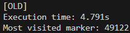
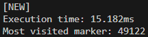

# Leet code - Sprint Markers

This repository contains the 2 solutions i came up with to the following leet code problem:

`John trains to become a professional runner, by running everyday on a long straight track, with markers spaced evenly along the way. His coach gives to him a list of markers between which John must sprints (sprints can be forward or backward). Write a function that takes that list as parameter and return the marker that John visited the most during his training`

A marker is considered visited if John starts or stops a sprint at this marker, or go through it during a sprint.

The sprint list is formatted as such:
```ts
  const sprintList: Array<[number, number]> = [
    // sprint 1
    [ 3, 7 ],
    // sprint 2
    [ 4, 1 ],
    // sprint 3
    [ 5, 2 ],
    // sprint 4
    [ 2, 8 ]
  ]
```

### Solutions
The first implementation if came up with during the test worked fine, but wasn't efficient enought for the biggest sprint lists, taking too much time to find the answer.


Since it was a straight forward implementation without any shinanigans, i was curious as of how to improve drastically such a simple design, it had to be a bit "out of the box".

So i sat and came up with the second implementation, that is indeed much, much faster.

